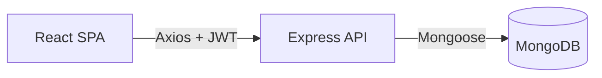
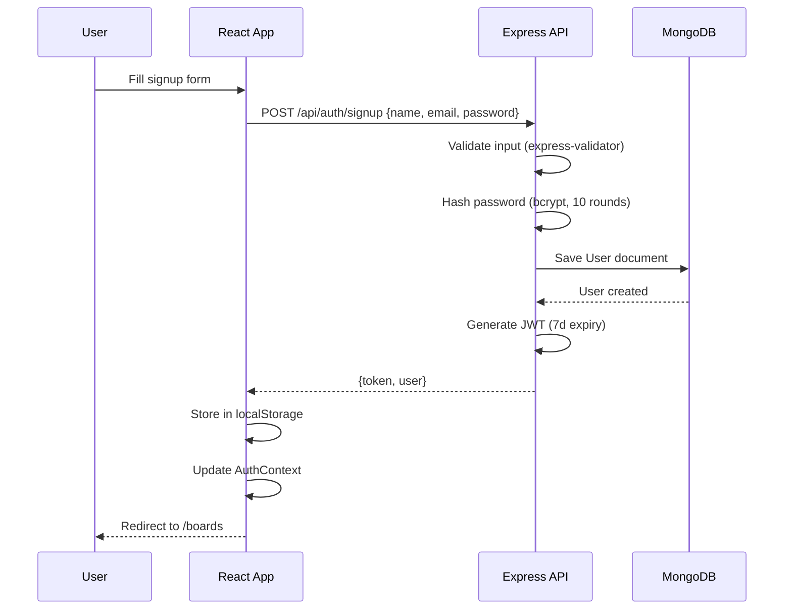

# Mini Jira — Walkthrough & Architecture Guide

## What Was Built

A complete Mini Jira clone with the MERN stack:

| Layer | Tech | Key Files |
|-------|------|-----------|
| **Backend** | Express + Mongoose + JWT | [index.js](file:///home/mayurpatil/Desktop/projects-sprint/Mini%20Jira/server/index.js) |
| **Models** | User, Board, Task | [User.js](file:///home/mayurpatil/Desktop/projects-sprint/Mini%20Jira/server/models/User.js), [Board.js](file:///home/mayurpatil/Desktop/projects-sprint/Mini%20Jira/server/models/Board.js), [Task.js](file:///home/mayurpatil/Desktop/projects-sprint/Mini%20Jira/server/models/Task.js) |
| **Auth** | JWT + bcrypt | [authController.js](file:///home/mayurpatil/Desktop/projects-sprint/Mini%20Jira/server/controllers/authController.js), [auth middleware](file:///home/mayurpatil/Desktop/projects-sprint/Mini%20Jira/server/middleware/auth.js) |
| **Frontend** | React + Vite + @dnd-kit | [App.jsx](file:///home/mayurpatil/Desktop/projects-sprint/Mini%20Jira/client/src/App.jsx) |
| **State** | Context API | [AuthContext.jsx](file:///home/mayurpatil/Desktop/projects-sprint/Mini%20Jira/client/src/context/AuthContext.jsx) |
| **DnD** | @dnd-kit/core + sortable | [BoardDetailPage.jsx](file:///home/mayurpatil/Desktop/projects-sprint/Mini%20Jira/client/src/pages/BoardDetailPage.jsx) |

## Verification

✅ `npx vite build` — **100 modules transformed, zero errors**

---

## 1. Architecture Decisions

| Decision | Why |
|----------|-----|
| **Context API** over Redux | Only auth state is global — Redux is overkill |
| **localStorage** for JWT | Simpler for learning; HTTP-only cookies need CSRF handling |
| **@dnd-kit** over react-beautiful-dnd | Actively maintained, lightweight, modern hooks API |
| **express-validator** | Declarative input validation in route definitions |
| **bcryptjs** (not bcrypt) | Pure JS, no native build dependencies |
| **Flat CSS** | No build tools needed; easy to understand for beginners |

---

## 2. Authentication Flow

On subsequent requests, the **Axios interceptor** reads the token from localStorage and adds `Authorization: Bearer <token>` to every request. The **auth middleware** verifies it before any protected route runs.

---

## 3. Request Lifecycle Example: Creating a Task

1. User fills the "Add Task" form on the board page and clicks submit
2. [BoardDetailPage](file:///home/mayurpatil/Desktop/projects-sprint/Mini%20Jira/client/src/pages/BoardDetailPage.jsx#23-246) calls `API.post('/tasks', { title, description, board: boardId })`
3. **Axios interceptor** adds `Authorization: Bearer <token>` header
4. Express receives the request → [auth](file:///home/mayurpatil/Desktop/projects-sprint/Mini%20Jira/server/middleware/auth.js#11-30) middleware verifies JWT → sets `req.user.id`
5. `taskController.createTask()` runs:
   - Validates input via `express-validator`
   - Checks the user has access to the board
   - Creates the Task document in MongoDB
   - Populates `assignedTo` and `createdBy` references
   - Returns the populated task
6. React receives the response, adds it to the [tasks](file:///home/mayurpatil/Desktop/projects-sprint/Mini%20Jira/client/src/pages/BoardDetailPage.jsx#147-149) array state
7. The new task appears in the "To Do" column instantly

---

## 4. How to Extend This Project

| Feature | Changes Needed |
|---------|---------------|
| **Priority** | Add `priority: { type: String, enum: ['Low', 'Medium', 'High'] }` to Task model; add a select dropdown in the create form; color-code cards |
| **Due Dates** | Add `dueDate: Date` to Task model; show countdown/overdue badge on cards |
| **Comments** | New `Comment` model (`text`, ref [Task](file:///home/mayurpatil/Desktop/projects-sprint/Mini%20Jira/client/src/components/TaskCard.jsx#11-60), ref `User`); new API routes; comment list UI on task detail modal |
| **Labels** | Add `labels: [String]` to Task; tag picker UI; filter tasks by label |
| **Notifications** | Socket.io for real-time updates when assigned to a task |
| **File Uploads** | Multer middleware; `attachments` array on Task model |

---

## 5. Common Interview Questions From This Project

### Backend / Node.js
1. **How does JWT authentication work?** — Token is signed on login with a secret, sent to client, attached to every request via Bearer header, verified by middleware on each protected route.
2. **Why hash passwords? Why bcrypt?** — Never store plaintext passwords. bcrypt uses salted hashing with configurable rounds, making brute-force attacks expensive.
3. **What is middleware in Express?** — Functions that run between receiving a request and sending a response. Used for auth, logging, error handling, etc.
4. **How do you handle errors?** — Try/catch in each controller + a global error handler in [index.js](file:///home/mayurpatil/Desktop/projects-sprint/Mini%20Jira/server/index.js).

### Frontend / React
5. **What is Context API? When would you use Redux instead?** — Context provides global state without prop drilling. Use Redux when state logic is complex (many reducers, middleware, dev tools needed).
6. **How does the PrivateRoute work?** — It checks for a token in AuthContext; if missing, redirects to `/login` via `<Navigate>`.
7. **Explain the drag-and-drop implementation** — `DndContext` wraps the board. Each column is a droppable zone (`useDroppable`). Each card is draggable (`useSortable`). On `onDragEnd`, we determine the new status and optimistically update state before calling the API.

### Database / MongoDB
8. **What are refs in Mongoose?** — References to documents in other collections (like foreign keys). Populated with `.populate()` to join data.
9. **Why use `$or` in the boards query?** — To find boards where the user is either the owner OR a member, in a single query.

### System Design
10. **How would you scale this?** — Add Redis for sessions, message queues for notifications, horizontal scaling with load balancer, CDN for static assets.
